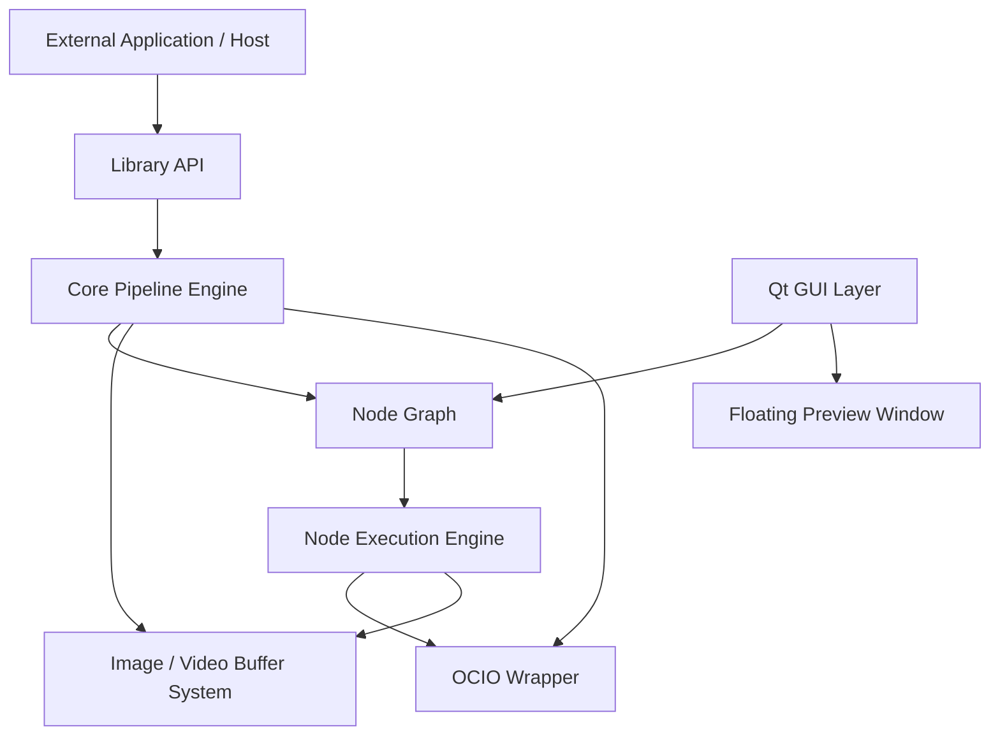
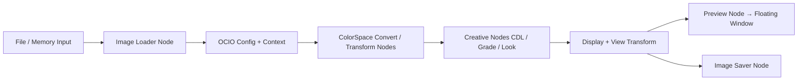
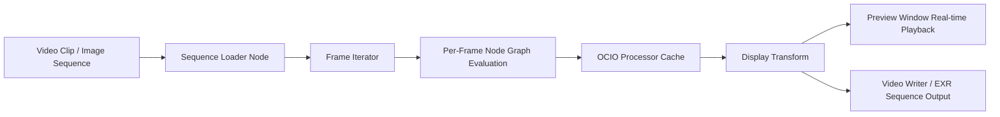

**Here is a clean, professional Markdown Process Chain** for your OCIO Node-based Color Management System.

---

# MOKM Color Processor - Process Chain & Architecture

## 1. Project Goals

- **Core**: Powerful node-based color management system powered by **OpenColorIO**.
- **Dual Use**: Works for both **still images** and **video sequences**.
- **Highly Integratable**: Can be used as a **C++ library** (headless), as well as with full Qt GUI.
- **Modular**: Easy to embed into other software pipelines.

---

## 2. High-Level Architecture



### Layered Design (Important for Integration)

| Layer                    | Name                        | Integratable | Description |
|-------------------------|-----------------------------|--------------|-----------|
| **Layer 0**             | Host / External App         | Yes          | Your other tools, DCCs, renderers |
| **Layer 1**             | **MOKM Color Lib**          | **Yes**      | Core + Nodes + Pipeline (no Qt) |
| **Layer 2**             | Node Graph System           | Yes          | Graph definition & evaluation |
| **Layer 3**             | OCIO + Processing Engine    | Yes          | Color science core |
| **Layer 4**             | Qt GUI (Optional)           | Yes          | Node editor + Preview window |

You can link only `MOKMColorLib` without any GUI.

---

## 3. Process Chain (Image & Video)

### Still Image Process Chain



### Video / Sequence Process Chain



---

## 4. Detailed Process Flow

1. **Input Stage**
   - Load image or image sequence into `ImageBuffer` (float32 / half-float)
   - Attach source color space information

2. **Configuration Stage**
   - Load OCIO config
   - Set Context variables (`$SHOT`, `$SEQ`, etc.)

3. **Graph Evaluation Stage**
   - Topological sort of nodes
   - Lazy / Dirty-flag evaluation
   - Processor caching (very important for performance)

4. **Processing Stage**
   - Each node creates or reuses `OCIO::CPUProcessor` or `GPUProcessor`
   - Apply transform on `ImageBuffer`
   - Support ROI (Region of Interest) for fast previews

5. **Output Stage**
   - Preview Window (floating, frameless)
   - File output (with correct metadata)
   - Library callback / signal for external tools

---

## 5. Library Integration Design (Key for Reusability)

### Library Structure

```cpp
// Public API (Header-only where possible)
namespace mokm {

    class ColorPipeline;
    class NodeGraph;
    class ImageBuffer;
    class OCIOWrapper;

    // Main entry points
    std::unique_ptr<ColorPipeline> CreatePipeline();
    
    // Headless usage
    void ProcessImage(ColorPipeline* pipeline, ImageBuffer& buffer);
    void ProcessSequence(ColorPipeline* pipeline, const SequenceDesc& seq);
}
```

**GUI Separation**:
- All GUI code lives in a separate static/shared library (`MOKMColorGUI`).
- `MOKMColorLib` has **zero Qt dependency**.

---

## 6. Node Categories (Final List)

### Core Nodes (Must Build First)
- **Input**: Image Loader, Sequence Loader, Solid Color
- **OCIO Core**: Config Loader, ColorSpace Convert, DisplayView, Look Transform, File Transform
- **Output**: Image Saver, Preview Node
- **Utility**: Switch, Cache, Group

### Grading Nodes
- CDL, Grade, Exposure, Contrast, Saturation, Curve, HueCorrect

### Technical Nodes
- Premult/Unpremult, Crop, Resize, Merge/Blend, Channel Split/Join

### Analysis Nodes
- Histogram, Vectorscope, Pixel Probe

---

## 7. Preview System (As Requested)

- **Floating Preview Window**:
  - Frameless (`Qt::FramelessWindowHint`)
  - Always inside main window bounds
  - Can be docked or free-floating inside app
  - Receives image from **Preview Node** via signal/slot or callback
  - Supports real-time playback for video
  - Independent OCIO Display/View selector

---

## 8. Development Phases

**Phase 1 – Core Library**
- ImageBuffer class
- OCIO Wrapper
- Basic Node base class
- Graph evaluation engine
- Image Loader + Saver + ColorSpace Convert + Preview

**Phase 2 – GUI**
- Integrate Qt Node Editor
- Floating Preview Window
- Node inspectors

**Phase 3 – Video Pipeline**
- Sequence support + frame caching
- Real-time playback

**Phase 4 – Advanced & Polish**
- GPU processing, LUT baking, compound nodes, plugin system

---

Would you like me to expand any section? For example:

- Full `CMakeLists.txt` structure for library + GUI separation
- Detailed class diagram
- Code skeleton for `ImageBuffer`, `ColorNode`, or `PreviewWindow`

Just tell me what you need next.
